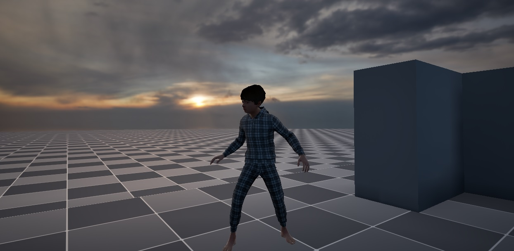
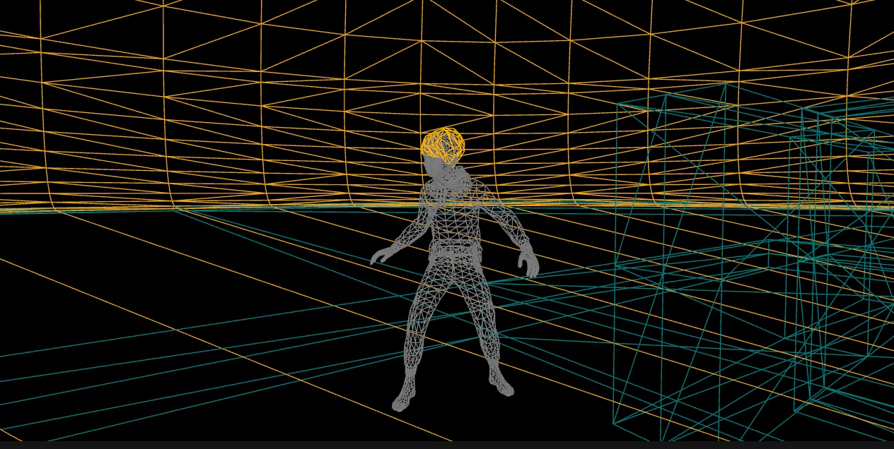

# Experimentation with Standalone VR Building in UE

[-> download zip](https://mab.to/5PZVbjJ69dAZH/eu1)

Please note:

Installing the apk to your Oculus Quest can be done by running the .bat file on windows.

*It is possible that after installation of the apk errors might occur connected to texture streaming. It eventually worked for me but only sometimes and I did not test on other headsets. This truely is experimental.*

[-> documentation](https://github.com/adamtgarde/orientation_doc/blob/main/Content/Engine.md)

(Private repository for my orientation project and only accessable for invited accounts. If you are interested, please contact me.)